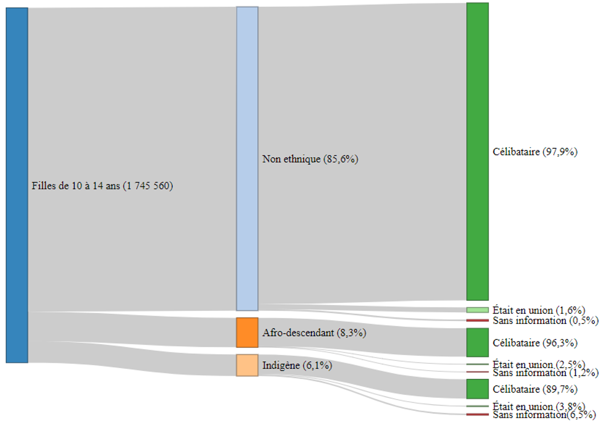

## Résumé

Dans le cas de l’Amérique latine, les mariages forcés/précoces (MFP) ne sont répandues dans aucun de ses pays, mais elles se concentrent sur des territoires spécifiques et sur des groupes de population particuliers, comme c’est le cas des communautés autochtones. Il existe des opérations statistiques telles que les recensements et les statistiques de naissances/décès qui n'ont été exploités auparavant, pour comprendre s'il existe des facteurs associés qui peuvent être associés à cet pratique, si elles sont exclusives ou plus fréquentes dans les communautés autochtones. Même d'évaluer si le fait d'avoir subi l'une de ces pratiques augmente la prévalence de décès maternelle de ces filles et adolescente.
L'objectif principal de ce travail vise à combler la lacune dans les connaissances sur les MFP d'une approche démographique, parmi les populations autochtones d'Amérique latine.  Plus spécifiquement, elle vise à (1) déterminer si le mariage précoce est-il un facteur associé aux décès maternels des adolescentes et des filles en Colombie et; 2) déterminer si l’appartenance ethnique augmente la prévalence associée à cette relation. 
Pour ces analyses, nous utilisons des micro-données de naissances et décès provenant de systèmes de statistiques de l’état civil et recensements de la population de la Colombie. Les analyses se dérouleront en deux étapes, où (1) une analyse descriptive multivariée sera réalisée pour identifier les facteurs associés aux communautés qui font les pratiques, (2) puis estimer la prévalence de la pratique en différenciant les estimations par groupes de population spécifiques.

**Mots-clés** : pratiques traditionnelles néfastes, les mariages forcés/précoces, Mortalité maternelle, violence basée sur le genre, objectifs de développement durable, mesure prévalence, analyse multivariée, populations autochtones.


## Analyse descriptive

```go

```

Selon la Figure 3 , la Colombie comptait 1 860 547 adolescents âgés de 15 à 19 ans en 2018. Sur ce total, 5.6 % correspondent à la population indigène, 7.8 % à la population afro-descendante et les 86.5 % restants correspondent à ceux qui n'appartiennent à aucun groupe ethnique . À première vue, on constate que la fréquence des adolescentes ayant déjà été en union  est plus élevée chez les femmes indigènes (23.8 %), contre 18.2 % chez les afro-colombiennes et 14.3 % chez les femmes n'appartenant à aucun groupe ethnique. Pour le groupe d'âge 10-14 ans (annexe 1), les valeurs sont respectivement de 3.6 %, 2.5 % et 1.6 %, ce qui montre que l'ordre de participation identifié pour le groupe d'âge 15-19 ans se maintient pour ce groupe d'âge. Une constatation intéressante est le comportement de la catégorie "Sans information" sur l'état civil, qui correspond aux cas où le répondant n'a pas voulu donner l'information, qui a un pourcentage élevé de 6% pour les mineurs indigènes dans les deux groupes d'âge. Cette catégorie peut cacher des cas d'unions précoces pour lesquelles le chef de famille, conscient de l'illégalité des unions avec des mineurs, a préféré ne pas répondre. Ce résultat sera analysé plus en détail à la lumière de l'ACM et de l'analyse de régression ci-dessous.
