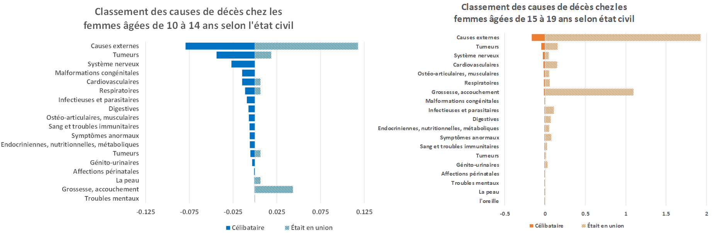

```
Figure 1 Classement des principales causes de décès des filles âgées de 10 à 14 ans et de 15 à 19 ans, en fonction du taux de mortalité spécifique.
Source : DANE, enregistrement des naissances et des décès, calculs propres.

```


Analyse des taux de mortalité spécifiques, selon les grands groupes de causes de décès de la CIM10 chez les femmes âgées de 10 à 14 ans (et de 15 à 19 ans), divisés par le nombre de femmes de la même tranche d'âge pour cette année. Selon la Figure 1, les décès dus à la grossesse et au couchement chez l'ensemble des adolescentes de 15 à 19 ans occupent la 3ème place sur 18 dans le classement des causes de décès. 

 

```
Figure 2. Classement des principales causes de décès des filles âgées de 10 à 14 ans et de 15 à 19 ans, selon le taux de mortalité spécifique et l'état matrimonial.
Source : DANE : DANE, statistiques vitales des décès et recensement, calculs propres.
```

Cependant, le calcul de ces mêmes classements, désagrégés selon l'état matrimonial, donne lieu à la Figure 2, qui montre une différence entre les causes de décès des filles de 10 à 14 ans qui ont déjà été en union et celles qui ne sont pas, où la mortalité due à la grossesse et au couchement est classée 17e sur 18 pour les filles non mariées, alors qu'elle est classée 2e pour les filles qui ont déjà été en union. Ce même exercice pour le groupe d'âge 15-19 ans montre également une différence entre les causes de décès des adolescentes, où la mortalité due à la grossesse et au couchement est classée 7e sur 18 pour les filles non mariées, alors qu'elle est classée 2e pour les filles qui ont déjà été en union.
