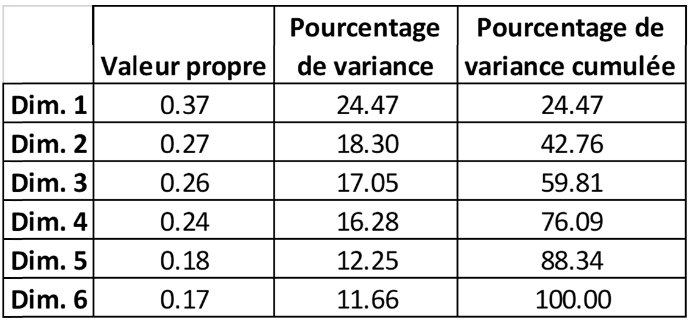
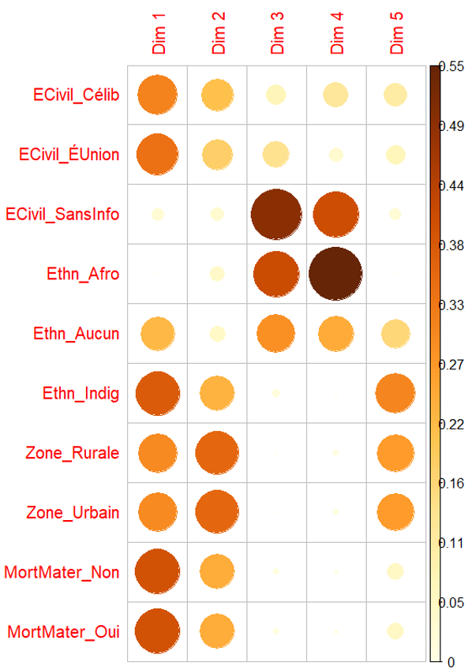

Question de recherche: Analyse des correspondances multiples de la mortalité maternelle et les unions précoces.

L'ACM a été réalisée pour illustrer la relation entre les variables qui seront incluses dans le modèle de régression. Nous montrerons ici 1) la qualité de la représentation, 2) l'analyse des cartes de correspondances multiples, 3) la contribution des catégories et l'interprétation des dimensions, 4) et les associations entre les catégories.

 
```
Table 1.  Tableau des valeurs propres à l'ACM.
```


En ce qui concerne la qualité de la représentation des catégories dans le premier plan (Dimension 1 et 2), le tableau des valeurs propres (Tableau 1) montre que sur les 100% de l'inertie (variance) dans les 6 dimensions, dans les plans 1 et 2, 42.8% sont résumés, ce qui est assez bon. Les catégories qui contribuent ensemble le plus au 1er axe (86%) et au 2ème axe (83%) sont Mortalité Maternelle : Oui, Ethnicité : Indigène, État matrimonial : Toujours ensemble et Zone : Rurale. 

Figure 1. Plan factoriel 1 et 2, ACM
La Figure 6 montre l'association globale des catégories des variables dans le premier plan factoriel et la distance entre les points montre la similarité entre elles (KASSAMBARA, 2017). Ce graphique met également en évidence la qualité de la représentation dans le plan factoriel au moyen des couleurs de température, c'est-à-dire que plus la catégorie est rouge, mieux elle est représentée dans ce plan, et plus la catégorie est bleue, moins elle est représentée dans ce plan. En observant ce graphique, on constate que l'axe des x (ou facteur 1) divise l'information en deux grands groupes:
1.	(-∞, 0) qui correspond aux décès de filles et d'adolescentes qui ne sont pas décédées de causes associées à la mortalité maternelle. Elles se caractérisent par le fait qu'elles ne se reconnaissent dans aucun groupe ethnique, qu'elles ne sont pas en union et qu'elles vivent en milieu urbain.
2.	(0, ∞) qui correspond aux décès des filles et adolescentes de causes associées à la mortalité maternelle. Les filles décèdent de ce groupe se caractérisent par le fait qu'elles se reconnaissent comme indigènes, qu'elles ont vécu en union au cours de leur vie et qu'elles vivent principalement dans des zones rurales.

 
```
Figure 2. Contribution des catégories à l'ACM.
```

Une autre caractéristique intéressante de ce dernier groupe, bien que peu représentée dans ces dimensions factorielles, mais plutôt dans les dimensions 3 et 4 (Figure 2), est constituée par les catégories "afro-descendants" et "Sans information" sur l'état matrimonial. Là encore, une hypothèse émerge : la catégorie "pas d'information" de l'état civil masque en fait des cas d'unions précoces. Nous allons maintenant mesurer, à partir du modèle de régression, le changement dans la prévalence des décès maternels associés à cette catégorie.
